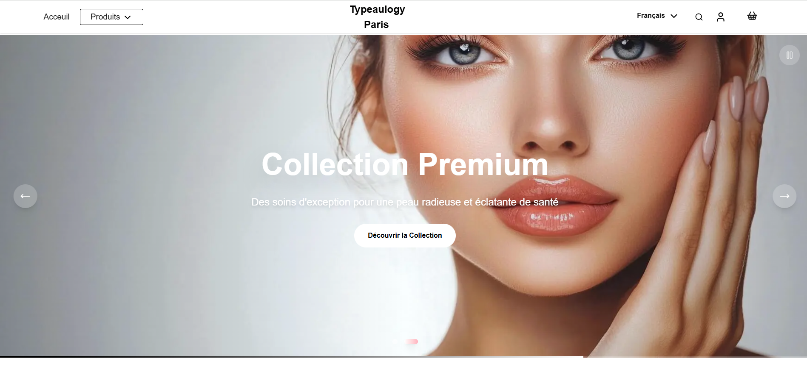
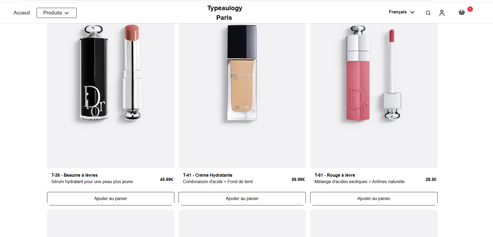
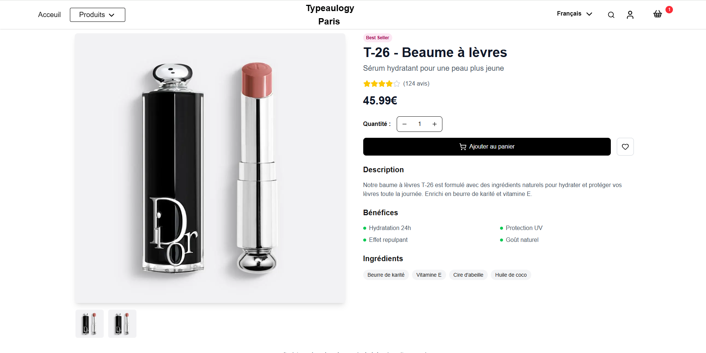
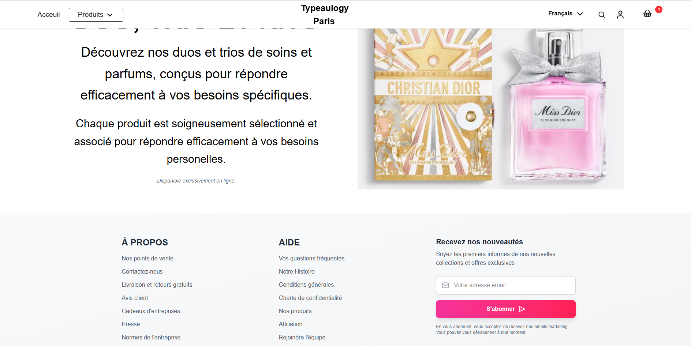

# 🛍️ Typology E-commerce Clone

A modern, fully-functional e-commerce website built with Next.js, TypeScript, and Tailwind CSS. This project demonstrates advanced React patterns, state management, and responsive design.


<div align="center">
  
  
  <br/>
  
  
</div>


## 🚀 Live Demo

**[View Live Site](https://typology-clone.vercel.app/)**

## ✨ Features

### 🛒 **Shopping Cart System**
- Global state management with React Context API
- Add/remove products with quantity controls
- Real-time cart updates and total calculations
- Persistent cart state during session


## 🛠️ Tech Stack

- **Framework**: Next.js 15 with App Router
- **Language**: TypeScript
- **Styling**: Tailwind CSS
- **Icons**: Lucide React
- **State Management**: React Context API
- **Deployment**: Vercel
- **Image Optimization**: Next.js Image component

## 🏗️ Architecture

### **Context Providers**
- `CartContext`: Global cart state management
- `SearchContext`: Search functionality and results

### **Components Structure**
```
src/
├── components/
│   ├── header.tsx          # Navigation with search & cart
│   ├── hero.tsx            # Animated hero carousel
│   ├── proprety.tsx        # Product grid
│   ├── footer.tsx          # Newsletter & links
│   └── secondeProprety.tsx # Additional content
├── pages/
│   ├── index.tsx           # Homepage
│   └── product/[id].tsx    # Dynamic product pages
├── context/
│   ├── CartContext.tsx     # Cart state management
│   └── SearchContext.tsx   # Search functionality
└── data/
    └── products.ts         # Product data & types
```


## 🎯 Key Features Implementation

### **Shopping Cart**
- Context API for global state
- Add/remove/update quantities
- Real-time total calculations
- Session persistence
---

*Built with ❤️ using Next.js, TypeScript, and Tailwind CSS*
